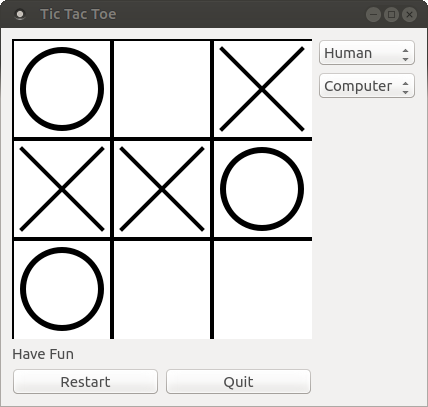

# Tic Tac Toe
This is a free Tic Tac Toe Game written in C++ and Qt. The computer agent uses the Minimax algorithm to determine its next move. Due to the search space size, the computer agent plays perfect and can not loose a game.

The project was developed in Qt-Creator 3.5.1.

## Game features
- HumanPlayer vs. HumanPlayer
- HumanPlayer vs. Computer

## Computer Agent
- uses a MiniMax algorithm to decide for the next move.
- can play as first or second player.
